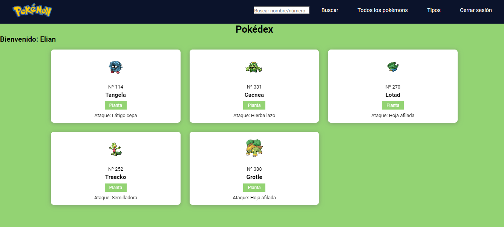

| Carnet    | Nombre                         | Auxiliar                    |
|-----------|--------------------------------|-----------------------------|
| 202044192 | Elian Angel Fernando Reyes Yac | Hector Josue Orozco Salazar |

# Backend
## Requerimientos del sistema
Lo único que necesita el usuario para acceder al programa es un navegador web.

## npm utilizados en el backend
* cors
* morgan
* express

## puerto de arranque:
* 5000

## end points utilizados:

* /usuarios : método post que recibe a través de las variables **usuario** y **password** los datos del usuario que desea ingresar a la pokédex. Si el usuario existe en el archivo **"users.json"**, devuelve la información de dicho usuario, de lo contrario regresa el valor "false", para que asi se llame a la ventana emergente que le indicara al usuario que la contraseña o usuario son incorrectos.

* /pokemons: método get que se utiliza para enviar toda la lista de pokémons, al archivo **"script.js"**, y asi mostrar todos los pokémons en la página.

* /Nombre_Pokedex: método post que recibe a través de la variable **nombre** el pokémon que el usuario ingreso para buscar, ya sea por el id o el nombre del pókemon, Si el pokémon es encontrado en el archivo **"pokedex.json"** el método devuelve los datos de dicho pokémon, de lo contrario envía los datos de que el pokémon no existe.
 
* /Tipo_Pokedex: método post que recibe a través de la variable **tipo** el tipo de pokémon que el usaurio quiere visualizar, y a con la variable **numTipo** se indica la posición del tipo de pokemon, para que asi devuelva la información de los 5 pokémons de cada tipo 

# Frontend

## Tecnologias utilizadas:

Para el desarrollo del fronted se hizo uso de:
* HTML: HTML se utilizo para crear toda la base del fronted.
* CSS: CSS se utilizo para darle estilo a la página.   
* Bootstrap: Bootstrap lo utilice unicamente para crear la ventana modal que se utiliza en el login al momento que la contraseña o usuario sean incorrectos. 
* JavaScript: con JavaScript se realizo todas las tarjetas de los pokémons, utilizando DOM. De la misma manera JavaScript se utilizo para realizar las peticiones a la api.

# Manual de uso:

## Login:
La pestaña de login como su nombre indica es la página por la cual el usuario se logeara para entrar a la pokédex. 

Si el usuario **no existe** se mostrara la siguiente ventana emergente

Si el usuario si existe, redirigirá al usuario a la pokédex. 

## Pokédex:
La pókedex contiene la referencia al nombre del usuario que inicio sesión, varios botones para las distintas formas de mostrar los pokémons, y el pie de pagina, con información legal, y una imagen de un snorlax.

### Todos los pokémons
Al presionar el botón se mostraran los 15 pokémons con los que cuenta la pokédex.

### Tipos de pokémons
**Botón Tipos/Fuego:** al presionar este botón se mostraran unicamente los pokémons de tipo fuego, con un fondo anaranjado claro.

**Botón Tipos/Agua:** al presionar este botón se mostraran unicamente los pokémons de tipo agua, con un fondo celeste.

**Botón Tipos/Agua:** al presionar este botón se mostraran unicamente los pokémons de tipo planta, con un verde claro.

### Búsqueda
La búsqueda se puede realizar indicando en la barra de búsqueda el nombre del pokémon o su número, y luego presionar el botón de **Buscar.**

Si el pokémon se encontro mostrara dicho pokémon.

Si el pokémon no se encontro mostrara la siguiente información

### Cerrar sesión
Al presionar el botón de **cerrar sesión** se cerrara la sesión y redigirá al usuario a la pagina de login